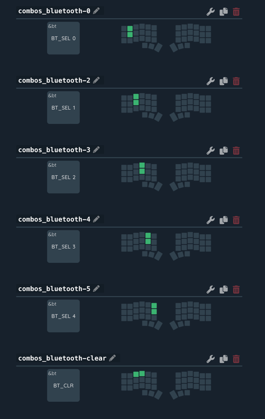
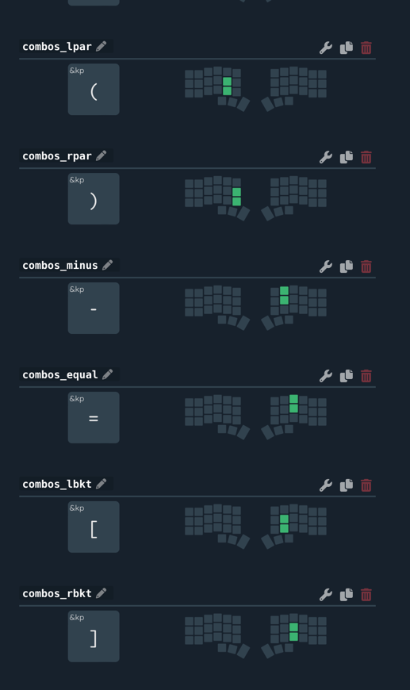

# zmk config


# Keymaps





# Keymap draw
https://github.com/caksoylar/keymap-drawer#command-line-tool-installation

## Generate yaml
```bash
keymap parse -c 12 -z config/corne.keymap > etc/docs/img/keymap.yaml
```

## Generate svg
```bash
keymap draw etc/docs/img/keymap.yaml > etc/docs/img/keymap.svg
```

# keymap online editor

https://nickcoutsos.github.io/keymap-editor/
